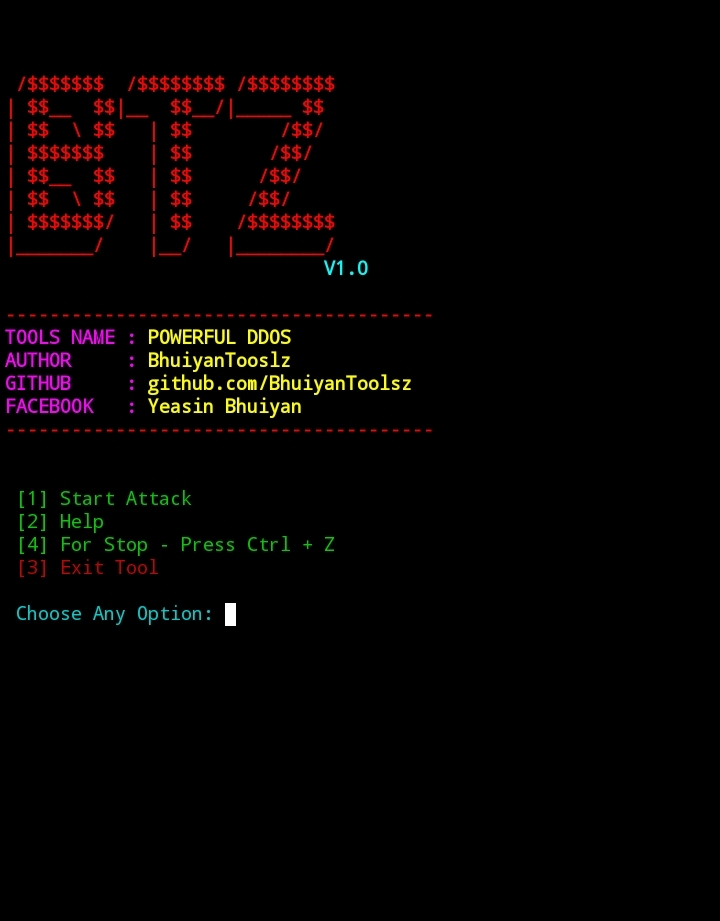
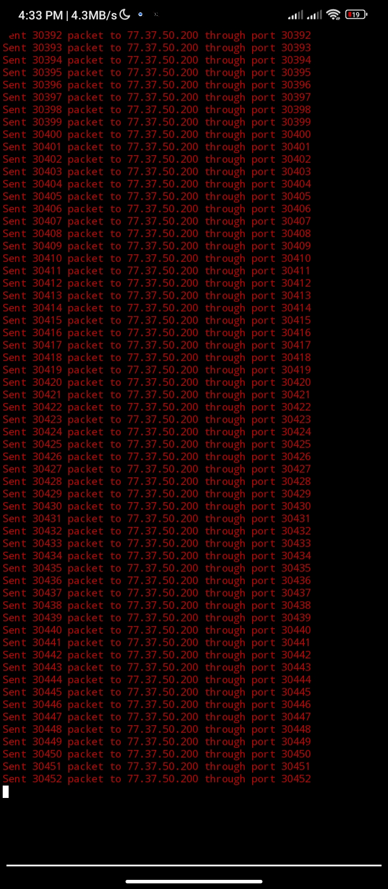

# Powerful-Ddos-

<h1 align="center">POWERFUL DDOS</h1>

  
  
  
  

---

<h2>Features</h2>
<ul>
  <li>User Interface with Menu: Easy option selection from the main menu.</li>

  <li>Multiple Attack Modes:
    <ul>
      <li>Custom Port Range Attack: Perform DDoS on a specific IP and port range.</li>

      <li>Random Port Attack: Send packets to random ports on a specified IP.</li>
    </ul>
  </li>

  <li>UDP Flood Attack: Sends UDP packets for network/server testing purposes.</li>

  <li>Packets Per Second (PPS) Control: Allows user to set the number of packets sent per second.</li>

  <li>IP Validation: Checks if the entered IP address is a valid IPv4.</li>

  <li>Graceful Exit: Allows stopping the attack with Ctrl+C and exiting from the menu.</li>

  <li>Colorful Terminal Output: User-friendly UI with colored terminal text.</li>

  <li>Error Handling: Warns and requests re-entry on invalid inputs.</li>

  <li>Educational Disclaimer: Includes ethical use and legal warnings.</li>

  <li>Cross-platform Compatible: Uses Python standard libraries for broad compatibility.</li>
</ul>

<h2>📥 Installation</h2>

<strong>Just copy and paste the commands below 👇</strong>

<pre style="background:#f4f4f4; padding:10px; border:1px solid #ccc;"><code>
pkg update && pkg upgrade
pkg install python
pkg install git
pkg install python git -y
git clone https://github.com/BhuiyanToolsZ/Powerful-Ddos-.git
ls
cd Powerful-Ddos-
python ddos.py
</code></pre>

<h2 style="color: purple;">Usage</h2>

Follow the steps below to use the tool:

1. Open your terminal or command prompt. 
2. Navigate to the directory where the tool is located. 
3. Run the command: 
<code>python python ddos.py</code>  
4. Follow the on-screen menu options: 
&nbsp;&nbsp;- Select <strong>Start Attack</strong> to launch an attack. 
&nbsp;&nbsp;- Choose between <em>Custom Port</em> or <em>Random Port</em> modes. 
&nbsp;&nbsp;- Enter the target IP address and other parameters as prompted. 
5. Press <kbd>Ctrl + C</kbd> to stop the attack anytime. 

<h2>Important Notes</h2>
<ul>
  <li>This tool is meant for <strong>educational</strong> and <strong>authorized</strong> testing only.</li>
  <li>Unauthorized use may be <strong>illegal</strong> and punishable by law.</li>
  <li>Ensure you have <strong>permission</strong> before testing any network or server.</li>
  <li>Use responsibly and ethically.</li>
  <li>The author is not responsible for any misuse or damage caused.</li>
</ul>

  ⚠️This tool is made for educational purposes only.
Do not use it for illegal activities.
You are fully responsible for your own actions while using this tool.
Developer is not responsible for any kind of misuse or damage.
<h2 align="center">🙋‍♂️ Developer Info</h2>

  
  
  
  
  
   

</html>
